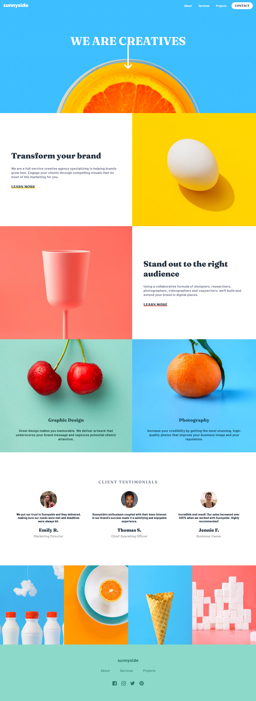

# Frontend Mentor - Sunnyside agency landing page solution

This is a solution to the [Sunnyside agency landing page challenge on Frontend Mentor](https://www.frontendmentor.io/challenges/sunnyside-agency-landing-page-7yVs3B6ef). Frontend Mentor challenges help you improve your coding skills by building realistic projects.

## Table of contents

- [Overview](#overview)
  - [The challenge](#the-challenge)
  - [Screenshots](#screenshots)
  - [Links](#links)
- [My process](#my-process)
  - [Built with](#built-with) 
- [Author](#author)

## Overview

### The challenge

Users should be able to:

- View the optimal layout for the site depending on their device's screen size
- See hover states for all interactive elements on the page

### Screenshots

#### Desktop Design

#### Mobile Design

### Links

- Solution URL: [GitHub](https://github.com/Aimal-125/sunnyside.git)
- Live Site URL: [GitHub Pages](https://aimal-125.github.io/sunnyside/)

## My process

### Built with

- Semantic HTML5 markup
- CSS custom properties
- Flexbox
- CSS Grid
- Mobile-first workflow
- Vanilla JavaScript

## Author

- Frontend Mentor - [@Aimal-125](https://www.frontendmentor.io/profile/Aimal-125)
- Twitter - [@aimal4910](https://www.twitter.com/aimal4910)
- LinkedIn - [@aimalkhan125](https://www.linkedin.com/in/aimalkhan125)
